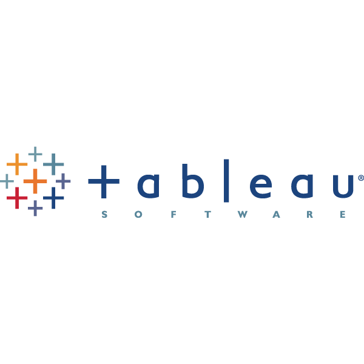

## 👋 Hi there, I'm Simran 

### 🎯 Senior Data Scientist | 7+ Years of Experience

- 🎓 Master's in Statistics from Columbia University, NY
- 🤖 I’m passionate about product analytics, causal inference, machine learning, and LLMs
- 💼 Hands-on experience across diverse industries: Tech, Retail, Banking, FinTech, Climate, and Energy
- 📫 Feel free to reach out: [simran.padam@columbia.edu](mailto:simran.padam@columbia.edu)
- 😄 Pronouns: She/Her
- ⚡ Fun fact: I’ll take a salad over pizza any day!

<!--
**simran-padam/simran-padam** is a ✨ _special_ ✨ repository because its `README.md` (this file) appears on your GitHub profile.
- 👀 
-->

## 🧰 Languages and Tools

