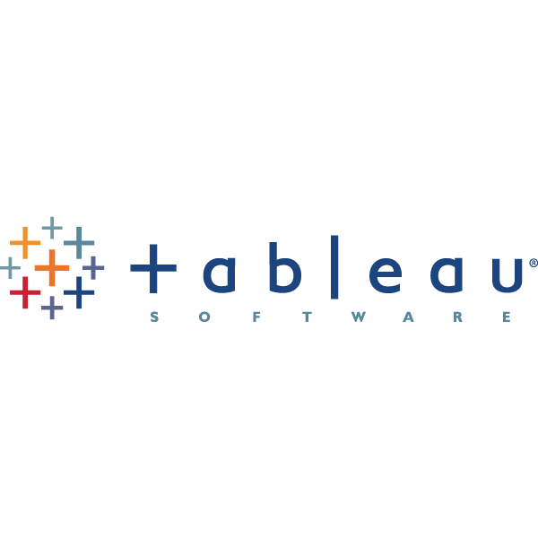

## 👋 Hi there, I'm Simran

### 🎯 Senior Data Scientist | Experimentation • Causal Inference • ML

Data Scientist with **8+ years of experience** specializing in ML, Experimentation, and Causal Inference.

---

### 🎓 Education
- **Master's in Statistics** — Columbia University, New York  
- **Master's in Economics** — Jawaharlal Nehru University (JNU), India  

---

### 🔬 Areas of Interest
- Product Analytics & Experimentation
- Causal Inference
- LLM Applications & NLP
- Machine Learning in Production

---

### 🛠 Tech Stack
`Python` • `SQL` • `PySpark` • `Pandas` • `Scikit-learn` • `Databricks` • `Snowflake` • `Airflow` • `LLMs`

---

### 📫 Connect With Me
📧 Email: simran.padam@columbia.edu  
💼 LinkedIn: www.linkedin.com/in/simran9

---

⚡ **Fun Fact:** I'll pick a good salad over pizza any day.

<!--
**simran-padam/simran-padam** is a ✨ _special_ ✨ repository because its `README.md` (this file) appears on your GitHub profile.
- 👀 
-->

## 🧰 Languages and Tools

